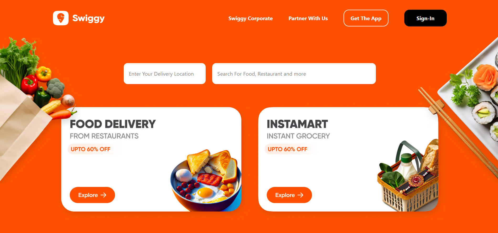
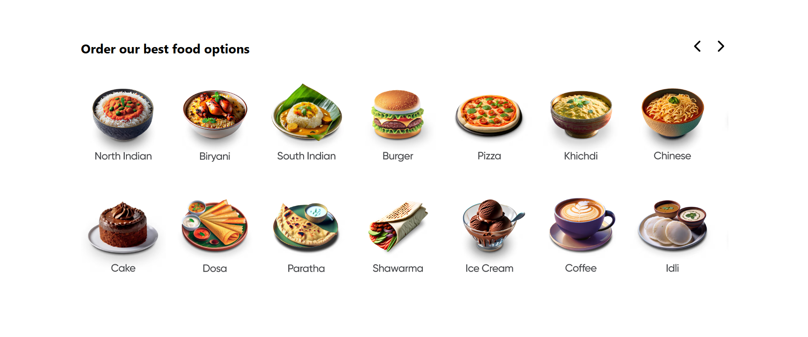
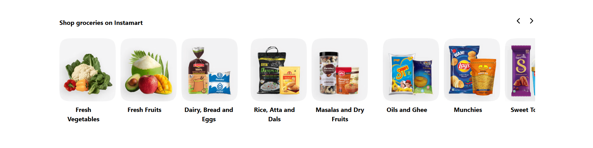
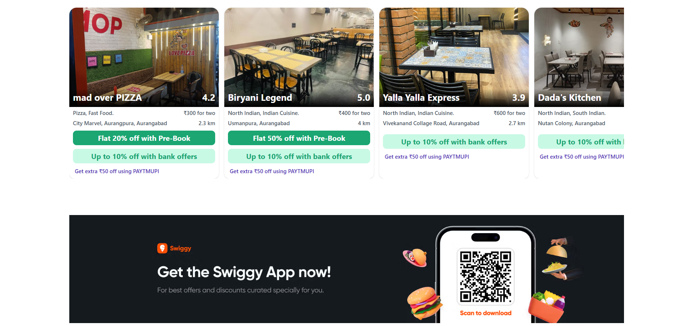
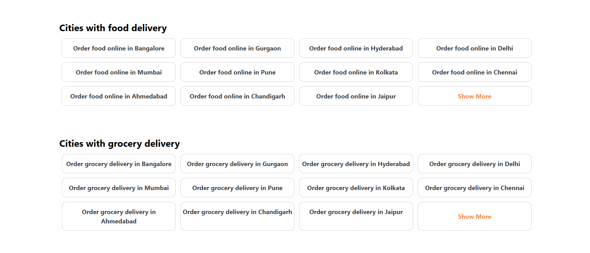
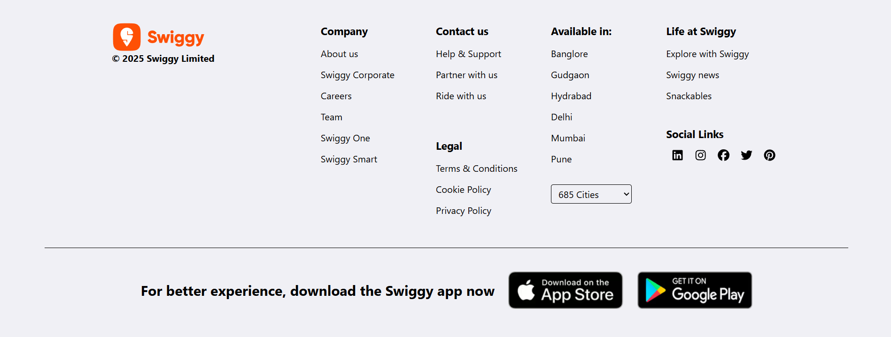
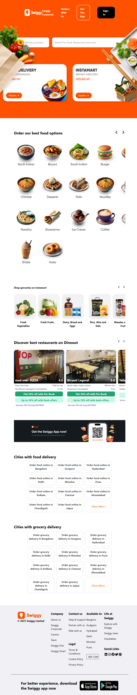

# 🍔 Swiggy Clone (Landing Page)

[Live Demo](https://swiggy-clone.vercel.app)

A responsive Swiggy landing page clone built using React and Tailwind CSS. This project focuses on creating a clean UI and smooth user experience similar to the Swiggy platform.

---

## 🚀 Features

- Dynamic food cards
- Horizontal scroll sections
- Reusable React components
- Clean and modern UI

---

## 🛠️ Tech Stack

- React.js
- Tailwind CSS
- JavaScript (ES6+)

---

## 📸 screenshots

### Home section



### Food Section



### Groceries section



### Restaurant section



### Cities section



### footer section



### full Landing Page



---

## ⚙️ Installation

```bash
git clone https://github.com/AsimKnight/swiggy-clone.git
cd swiggy-clone
npm install
npm run dev
```

---

## 📂 Project Structure

```
src/
 ├── components/
 ├── utils/
 ├── pages/
 ├── App.jsx
```

---

## 🎯 Future Improvements

- Make it responsive
- Add restaurant detail page
- Add cart functionality
- Integrate real API
- Add authentication (login/signup)

---

## 👨‍💻 Author

Asim Shaikh

---

## ⭐ Support

If you like this project, give it a star ⭐
